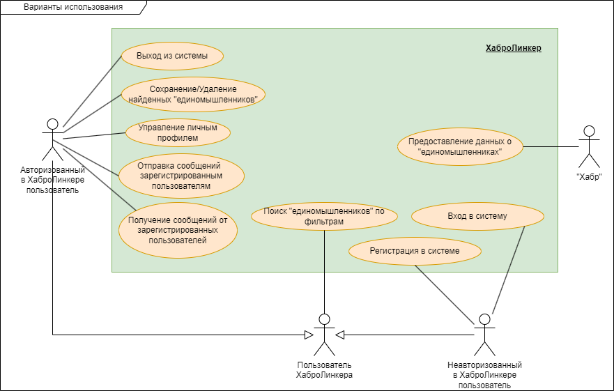

# Бизнес-требования

Разрабатываемый проект предназначен для упрощения поиска "единомышленников", заинтересованных в реализации различных IT-проектов.

## Термины

Вводится следующий список терминов:
- Система - разрабатываемый проект "Хабролинкер";
- "Единомышленник" - любой человек, информация о котором сохранена в системе для вывода в поиске. Информация о нём может быть получена как в результате регистрации в Системе, так и через внешних источников ("Хабр").

## Действующие лица

С системой взаимодействуют следующие действующие лица:
- "Хабр" - одноименный крупный в рунете веб-сайт, посвященный IT тематике и содержащий различную информацию о своих пользователях;
- Пользователь ХаброЛинкера - любой человек, взаимодействующий с Системой;
- Неавторизованный пользователь ХаброЛинкера - Пользователь ХаброЛинкера, который не выполнил вход в учётную запись в Системе;
- Авторизованный пользователь ХаброЛинкера - Пользователь ХаброЛинкера, который выполнил вход в учётную запись в Системе.

## Варианты использования

Варианты использования - высокоуровневые сценарии, описывающие задачи, которые выполняет система и действующие лица, которые в этих сценариях участвуют.

**"Хабр"**
- Предоставляет данные о "единомышленниках", зарегистрированных на сайте "Хабр".

**Пользователь ХаброЛинкера**
- Поиск "единомышленников" по фильтрам.

**Неавторизованный пользователь ХаброЛинкера**
- Регистрация в Системе;
- Вход в Систему.

**Авторизованный пользователь ХаброЛинкера**
- Управление данными личного профиля.
- Управление найденными "единомышленниками":
  - Сохранение;
  - Просмотр;
  - Удаление.
- Коммуникация с "единомышленниками":
    - Получение сообщений;
    - Отправка сообщений.
- Выход из Системы.

Диаграмма вариантов использования приведены на следующем рисунке.

