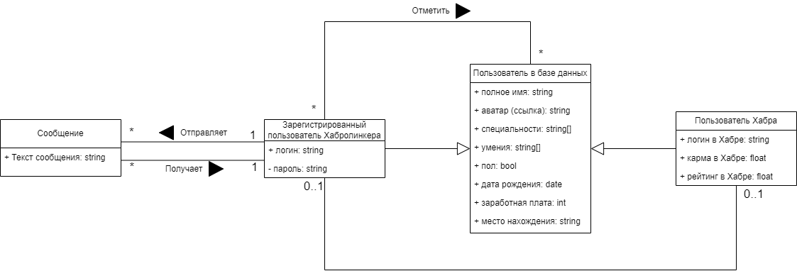

# Диграмма предметной области

## Глоссарий

Спиоск терминов:
- **Пользователь в базе данных** - запись об одном человеке. Именно она и выдается о поиске;
- **Пользователь Хабра** - Пользователь в базе данных, информация о котором получена с сайта "Хабр";
- **Зарегистрированный пользователь Хабролинкера** - Пользователь в базе данных, информация о котором получена при регистрации в Системе. Каждый Зарегистрированный пользователь Хабролинкера может связать свой аккаунт с аккаунтом Хабра, ранее не привязанному к аккаунту-Хабролинкера;
- **Сообщение** - текстовая информация, отправленная одним зарегистрированным пользователем Хабролинкера другому.

Диаграмма предментной области приведена на следующем рисунке.

## Текстовое описание

*Пользователь в базе данных* представляет собой перечень информации об одном человеке. Данная информация о человеке может формировываться либо при регистрации пользователя в Системе (в Хабролинкере), либо из учетных пользователей сайта Хабр. 

*Зарегистрированный пользователь Хабролинкера* имеет возможность связать свой аккаунт с аккаунтом Хабра, который ранее не был привязан к другому аккаунту Хабролинкера.

В процессе поиска *Зарегистрированный пользователь Хабролинкера* может отмечать найденных других *Пользователь в базе данных*, а также удалять эти отметки.

Помимо этого, *Зарегистрированный пользователь Хабролинкера* имеет возможность как отправлять *Сообщения* другим *Зарегистрированным пользователям Хабролинкера*, так и получать их.

Диаграмма предментной области приведена на следующем рисунке.

